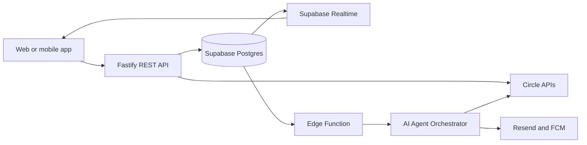

AbabilPay is organized around a Supabase-backed application core, Circle-powered wallet and USDC operations, and an AI agent layer that reacts to product events.

## Authentication and onboarding

Users sign in with Google OAuth through Supabase Auth. On first login, the platform creates the Supabase user record, provisions a Circle developer-controlled wallet, and asks the user to select a role.

| Step | Action | Stored in |
| --- | --- | --- |
| 1 | Google sign-in | `users.google_id` |
| 2 | Circle wallet creation | `wallets.circle_wallet_id` |
| 3 | Consumer or merchant role setup | `users.role`, `merchants.*` |
| 4 | Optional KYC for ramps | Supabase Storage, `users.kyc_status` |
| 5 | Dashboard routing | Supabase Auth session |

## Event-driven operations

Product events are written to Supabase and picked up by Edge Functions or backend workers. The frontend subscribes to user-scoped Supabase Realtime channels so wallet balances, invoice states, split payment status, and notifications update without polling.



## Wallet model

Each user sees one logical USDC balance. Under the hood, Circle manages chain-specific wallets and AbabilPay aggregates the balances into a single wallet view.

Supported chains in the current product plan:

- Ethereum
- Polygon
- Base
- Arbitrum
- Solana
- Avalanche

## Operational controls

| Control | Behavior |
| --- | --- |
| Row Level Security | User data is scoped by Supabase Auth UID. |
| Audit logs | AI and payment actions are written to `agent_logs` and transaction tables. |
| Webhook signing | Merchant webhook events are signed before delivery. |
| Slippage control | Auto-convert enforces a 0.5% maximum slippage target. |
| Multi-sig approvals | Enterprise accounts can require 2-of-3 approvals before outgoing transfers or payroll execution. |

## Local docs preview

Use the Mintlify CLI to preview documentation changes from this repository.

```bash
npm i -g mint
mint dev
```

The local preview is usually available at `http://localhost:3000`.
