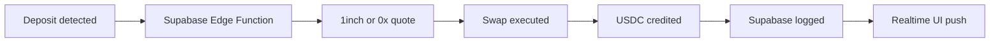

## Unified smart wallet

Each user has one logical wallet showing a unified USDC balance across supported chains. Circle Programmable Wallets manages the chain-specific accounts, while Supabase Realtime pushes balance changes to the app.

| Feature | Description |
| --- | --- |
| Unified balance | Aggregated USDC total across Ethereum, Polygon, Base, Arbitrum, Solana, and Avalanche. |
| Chain breakdown | Expandable per-chain balance view. |
| Developer-controlled keys | Circle manages private keys, so users do not handle seed phrases. |
| Realtime sync | Supabase Realtime updates balances after confirmed transactions. |
| Transaction history | Ledger from `transactions`, filterable by chain, type, and date range. |
| QR receive | Generate receive QR codes for in-person or remote payments. |
| Address book | Save frequent recipient wallets per user. |
| Multi-sig support | Enterprise accounts can require approvals before outgoing transfers. |

## Auto-convert

Auto-convert is the flagship settlement feature. When a non-USDC token is deposited or used for payment, AbabilPay can swap it to USDC through 1inch or 0x before crediting the wallet.

| Mode | Behavior |
| --- | --- |
| Always convert | Default mode. Every non-USDC deposit is swapped without user action. |
| Manual confirm | User receives a notification and approves the swap before execution. |
| Threshold mode | Conversion runs only when token value exceeds a configured USD amount. |
| Slippage protection | Max 0.5% slippage target. If exceeded, the swap is queued and retried. |
| Supported tokens | ETH, MATIC, SOL, BNB, USDT, DAI, WBTC, AVAX, ARB, and liquid ERC-20 assets. |

## Cross-chain bridge

AbabilPay uses Circle Cross-Chain Transfer Protocol (CCTP) for native USDC movement across chains. USDC is burned on the source chain and minted on the destination chain, avoiding wrapped assets.

| Feature | Detail |
| --- | --- |
| CCTP native transfer | Native burn-and-mint USDC movement. |
| Supported routes | Ethereum, Polygon, Base, Arbitrum, Avalanche, and Solana routes. |
| AI route selection | Agent chooses a route based on gas, cost, and speed. |
| Gas abstraction | Fees can be deducted from the USDC amount shown before confirmation. |
| Status tracking | Live bridge progress appears through Supabase Realtime updates. |
| Time estimate | Target experience is usually seconds to minutes depending on route and network state. |

## On-ramp and off-ramp

Circle Payments API powers fiat-to-USDC and USDC-to-fiat flows. KYC is verified once and KYC documents are stored in Supabase Storage.

| Direction | Supported methods | Planned regions |
| --- | --- | --- |
| On-ramp | Credit card, debit card, ACH, SEPA, bank wire | US, EU, UK |
| Off-ramp | Bank transfer to verified account | US, EU, UK |
| KYC level 1 | Up to $1,000 per day | All supported regions |
| KYC level 2 | Up to $50,000 per day | All supported regions |
| Fees | 1.5% on-ramp, 0.8% off-ramp | Shown before confirmation |

## Split payments

Split payments let a group share a bill through one payment session. The organizer creates a split, shares a link or QR code, and each participant pays their assigned share with any supported token.

| Feature | Description |
| --- | --- |
| Create split | Set total, participant count, and note in `splits`. |
| Share link or QR | Participants pay independently through a hosted flow. |
| Equal or custom amounts | Divide equally or assign individual amounts. |
| Live tracking | Supabase Realtime shows who has paid. |
| Expiry | Sessions expire after 7 days by default. |
| Auto payout | Once fully funded, USDC transfers to the organizer wallet. |
